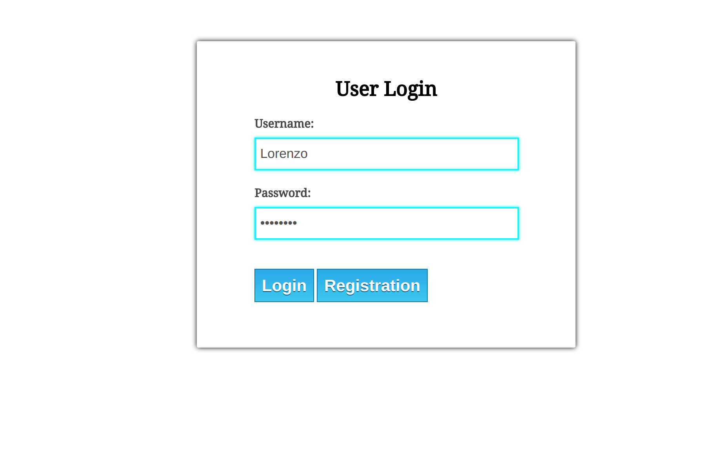
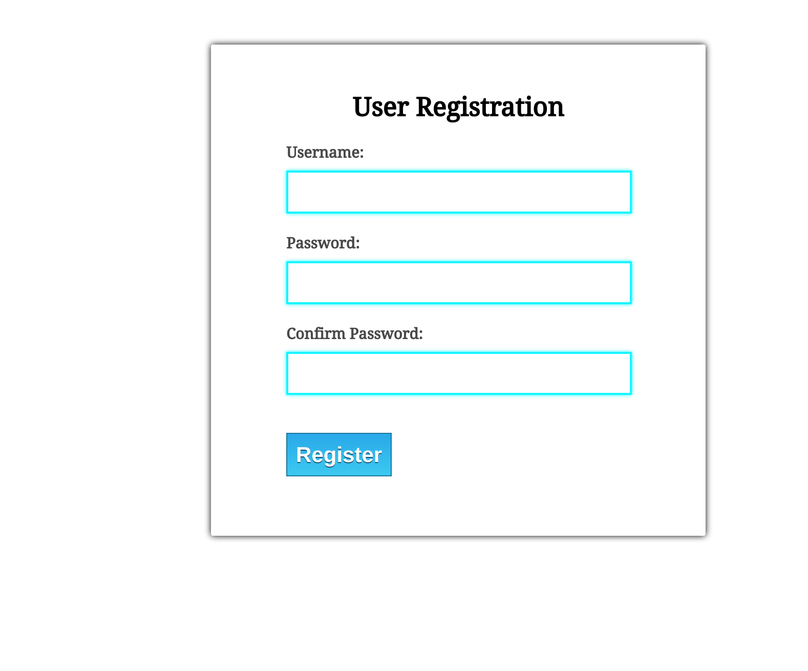
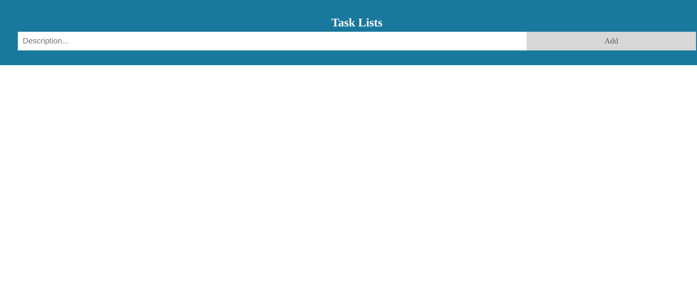
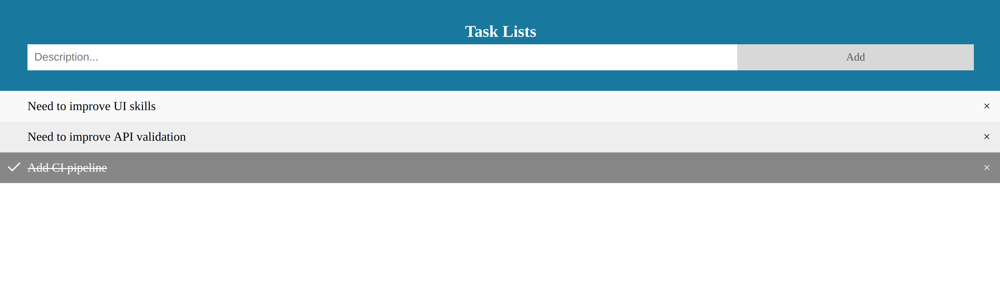

[](https://circleci.com/gh/lorenzomartino86/todolist)

## TODO List
A simple online TODO list with a web interface that can be used in all popular web browsers.

#### Use Cases
- User can sign in using unique login and password securely (this can be hard coded
  to a default user list, at list one user e.g. with username: test, password: pwd123)
- User can view her/his task list
- User can add/remove task
- All changes can be persistent to allow view them in next sign in by the same user
- Each task should display the date of last updates and description
- User can check/uncheck any task on their list
- Consider performance

#### Project Architecture
This project separates API from UI components through the usage of following modules:
- **api:** Maven module used to collect Rest API, business logic and persistence layer. This module is generating a Jar library.
- **ui:** Maven module used to handle ui components (html, javascript and css). This module is generating a WAR and depends on api.

This approach get the benefit that components are decoupled and can be built and deployed separately. 

Developments on the API component have been done following a TDD methodology.

I've tried to follow the *four rules of simple design* but the work is far to be completed:
1. Tests pass
2. Express intent
3. Dont repeate yourself
4. Small pieces of code.

I've spent a lot of time to define the overall UI components

#### Main Technologies Used

For the API components the main frameworks/tools used are:
- *OpenJDK 1.8* .
- *Spring Core, Beans and Context:* Used for facilitate dependency injection.
- *Spring MVC:* Used to facilitate the creation of rest endpoints.
- *Spring Data and Hibernate:* Used to facilitate database mapping.
- *Lombok:* Used to avoid common java boilerplate code.
- *Jackson:* Used for serialization/deserialization.
- *JUnit:* Used for test automation.
- *Mockito:* Used for stub during test automation.
- *Spring Test:* Used for facilitate testing of Spring Components.
- *H2:* as in memory relational database.

Basically the build process run unit and integration tests separately and generates a Jar file.

For the UI components the main frameworks/tools used are:
- *HTML5*
- *CSS3*
- *Javascript*
- *jQuery*: Used to facilitate DOM manipulation, event handling and Ajax 
 

#### Instructions for build
In order to build the final WAR file  we need to perform following commands:

1. Build API module
```
   mvn clean install -f api/pom.xml
```

2. Build UI module
```
   mvn clean install -f ui/pom.xml
```

Now we can deploy generated WAR to a Tomcat container. The generated file is under *ui* module
```
  ui/target/todolist.war
```


#### Build and deploy with docker
Alternatively we can speed up deployment using docker. Dockerfile provided in this project builds an image starting from *tomcat:8.0.52-jre8-alpine* docker tag image.
After the step 2 of the build instructions we can build a docker image:

```
    docker build -t local-tomcat .
```

And then run docker container forwarding port 8080 from tomcat service:
```
    docker run -it -p 8080:8080 local-tomcat
```

#### Web App Usage
In order to do a manual test of APIs we can import Postman collection stored under folder *postman/todolist.postman_collection.json*.

The web app can be reached at the address http://localhost:8080/todolist. We can Login via specific form:

  
  
If not registered we can do it in this form:

  
  
After registration/login form we are redirected to our task list management:

 
 
We can add new task, remove an existing one and check/unckeck from the list and we can see a result as the following one:

 

User can:
1. Add new task with a description
2. Remove a task from the list pressing button X on the right
3. Check/uncheck a task on the list just clicking on the item name
4. See when task has been updated last time just on mouse hover the task name (a tooltip will show the last update timestamp)

#### CI Pipeline

A CI pipeline can be checked in [circleci](https://circleci.com/gh/lorenzomartino86/todolist/tree/master).
It mainly build project components and run a Docker container in hosted CI server.

#### Improvements

There are infinite improvements for this project. Unfortunately the time spent to do this assignment was very limited (a couple of days).

1. We need to refactor the behavior on the Javascript files. In order to do that we can start adopting a testing framework (Mocha, Jasmine) to secure our next refactoring operations.
2. Enhance security with HTTPS for login and user session management.
3. Add more validations on backend API
4. We need to refactor CSS files as well.
5. Add Swagger Documentation for API management.
6. Refactoring API code.
7. Add acceptance criterion running as automated e2e tests on the pipeline.
8. Add test coverage reports and Sonar integration
